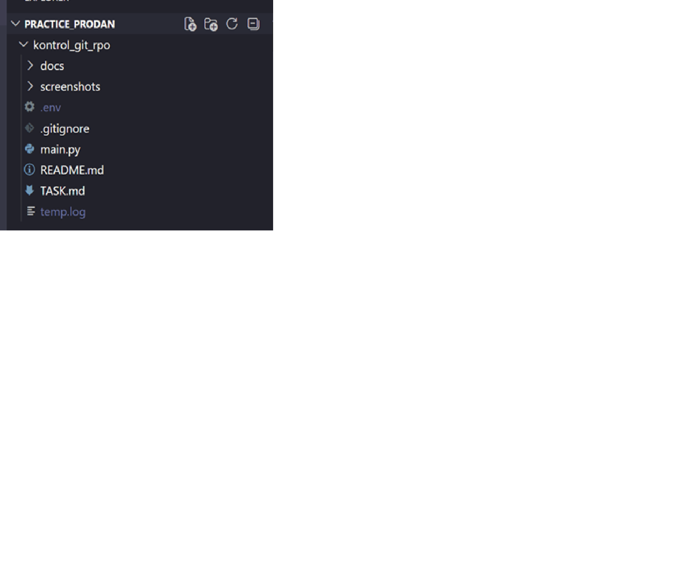
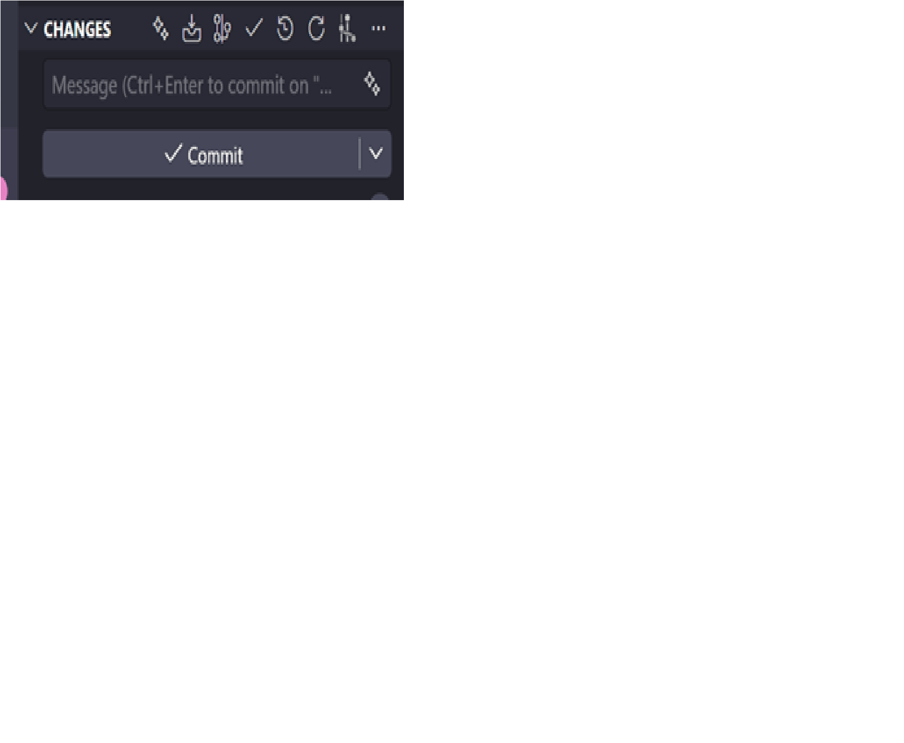
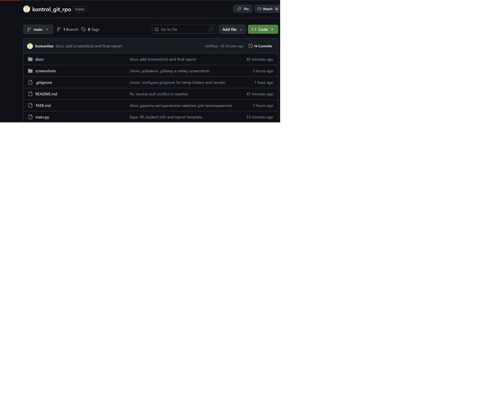
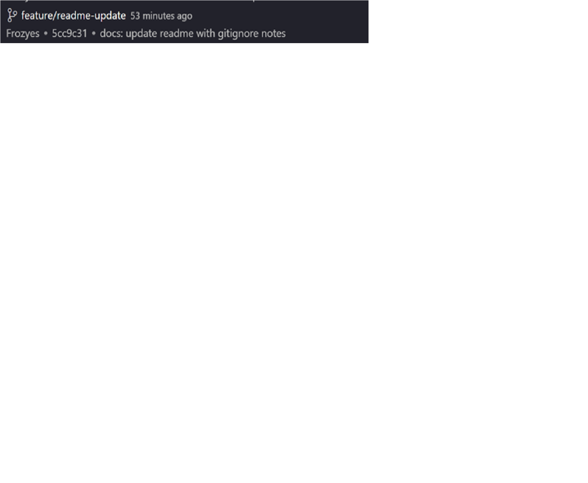

# Git Practice: ФАМИЛИЯ ИМЯ

Учебный проект для закрепления Git, GitHub и VS Code: README.md, .gitignore,
коммиты, ветки, merge, fetch, pull и разрешение конфликтов.

> Инструкция к работе — в файле [TASK.md](TASK.md).

Статус проекта: работа выполнена

## Информация о студенте

| Поле             | Значение                                       |
|------------------|------------------------------------------------|
| ФИО              | ФАМИЛИЯ ИМЯ                                     |
| Группа           | НАЗВАНИЕ ГРУППЫ                                 |
| Дисциплина       | Git и GitHub                                   |
| Дата выполнения  | 17.06.2026                                      |
| Ссылка на GitHub | https://github.com/loveunites/kontrol_git_rpo  |

## Цель работы

Закрепить полный цикл работы с Git и GitHub через графический интерфейс VS Code:
вход в аккаунт, клонирование, инициализация, stage и commit, публикация на GitHub,
push/sync, fetch, pull, работа с ветками, merge, разрешение конфликтов и настройка
`.gitignore`.

## Описание выполненных этапов

1. Открыл(а) проект-шаблон в VS Code и убедился(ась), что Git-репозиторий
   инициализирован, текущая ветка — `main`.
2. Проверил(а) структуру проекта: `main.py`, `README.md`, `.gitignore`,
   `docs/notes.md`, папка `screenshots/`.
3. Вписал(а) свои данные (ФИО и группу) в `main.py` и проверил(а) запуск
   командой `python main.py`.
4. Настроил(а) `.gitignore`: добавил(а) исключения для `.env`, логов `*.log`,
   виртуального окружения `venv/`/`.venv/`, кэша `__pycache__/` и временных папок.
5. Создал(а) демонстрационные файлы `.env` и `temp.log` и убедился(ась) через
   Source Control, что Git их не отслеживает.
6. Сделал(а) серию осмысленных коммитов через Source Control (Stage → Message → Commit).
7. Опубликовал(а) репозиторий на GitHub через `Publish Branch`.
8. Создал(а) ветку `feature/readme-update`, внёс(ла) изменения и закоммитил(а) их.
9. Слил(а) ветку `feature/readme-update` в `main` через Merge и отправил(а) на GitHub.
10. Выполнил(а) `Fetch` и `Pull`, увидел(а) разницу между ними на практике.
11. Создал(а) и разрешил(а) конфликт в `README.md`.
12. Оформил(а) `README.md` как отчёт, добавил(а) скриншоты и финальную историю в Git Graph.

## Использованные Git-действия

- Clone Repository
- Initialize Repository
- Stage Changes
- Commit
- Publish Branch
- Push / Sync Changes
- Fetch
- Pull
- Create Branch / Switch Branch
- Merge
- Resolve Conflict
- Git Graph

## Таблица Git-действий и их смысла

| Действие              | Где в VS Code                     | Смысл                                                   |
|-----------------------|-----------------------------------|---------------------------------------------------------|
| Clone Repository      | Command Palette → `Git: Clone`    | Копирует репозиторий с GitHub на компьютер              |
| Initialize Repository | Source Control                    | Создаёт локальный Git-репозиторий                       |
| Stage Changes         | Source Control, кнопка `+`         | Подготавливает файлы к коммиту                          |
| Commit                | Поле `Message` + кнопка `Commit`  | Сохраняет версию проекта в истории                      |
| Publish Branch        | Source Control                    | Публикует проект/ветку на GitHub                        |
| Push / Sync Changes   | Source Control                    | Отправляет и синхронизирует коммиты с GitHub            |
| Fetch                 | Source Control → `...` → `Fetch`  | Проверяет изменения на GitHub, не меняя локальные файлы |
| Pull                  | Source Control → `...` → `Pull`   | Загружает и применяет изменения с GitHub                |
| Create / Switch Branch| Панель снизу слева, Git Graph     | Создаёт и переключает ветки                             |
| Merge                 | Git Graph / Command Palette       | Объединяет изменения одной ветки с другой               |
| Resolve Conflict      | Редактор VS Code                  | Выбор или объединение конфликтующих изменений           |
| Git Graph             | Расширение Git Graph              | Показывает историю коммитов и веток                     |

## Разница между Fetch и Pull

`Fetch` загружает из GitHub только информацию о новых коммитах в удалённой ветке,
но **не меняет** мои рабочие файлы и текущую ветку — я лишь вижу, что локальная
ветка «отстаёт» на N коммитов. `Pull` делает то же самое, но сразу **применяет**
полученные изменения к текущей ветке (по сути `fetch` + `merge`).

На практике я изменил(а) `README.md` прямо на GitHub и сделал(а) `Fetch`: VS Code
показал, что на сервере появился новый коммит, но содержимое локального файла
осталось прежним. После `Pull` изменение с GitHub загрузилось и применилось
к локальному файлу.

## Конфликт и его решение

Я специально создал(а) конфликт: изменил(а) одну и ту же строку статуса проекта
в `README.md` двумя разными способами — локально в VS Code и напрямую на GitHub.
При `Pull` Git не смог автоматически объединить две версии одной строки, и в файле
появились маркеры конфликта:

```text
<<<<<<< HEAD
Статус проекта: локальная версия изменена в VS Code
=======
Статус проекта: версия изменена через GitHub
>>>>>>> origin/main
```

Я разрешил(а) конфликт в редакторе VS Code: выбрал(а) итоговый вариант строки,
удалил(а) все служебные маркеры `<<<<<<<`, `=======`, `>>>>>>>`, сохранил(а) файл,
добавил(а) его в Stage, сделал(а) коммит `fix: resolve pull conflict in readme`
и отправил(а) изменения на GitHub.

## Что я понял(а) про .gitignore

- `.gitignore` помогает не отправлять в GitHub временные и секретные файлы.
- Файл `.env` нельзя публиковать, потому что в нём могут быть токены и пароли.
- Логи `*.log` обычно не нужны в репозитории.
- Папки `venv/` и `.venv/` не добавляют в Git, потому что их можно создать заново.
- Перед коммитом нужно проверять Source Control.

## Скриншоты выполнения работы

### 1. Созданный проект в VS Code


### 2. Инициализированный репозиторий


### 3. Первый коммит


### 4. Репозиторий на GitHub


### 5. Созданная ветка


### 6. Результат merge


### 7. Выполнение Fetch / Pull


### 8. Итоговая история в Git Graph


## Вывод

В ходе контрольной работы я закрепил(а) полный практический цикл работы с Git
и GitHub через графический интерфейс VS Code: от инициализации репозитория и
коммитов до веток, merge, fetch/pull и разрешения конфликтов. Самым полезным
оказалось понимание разницы между `Fetch` и `Pull` и навык ручного разрешения
конфликта. Теперь я понимаю, зачем нужен `.gitignore` и как не допустить попадания
секретов и временных файлов в репозиторий.
